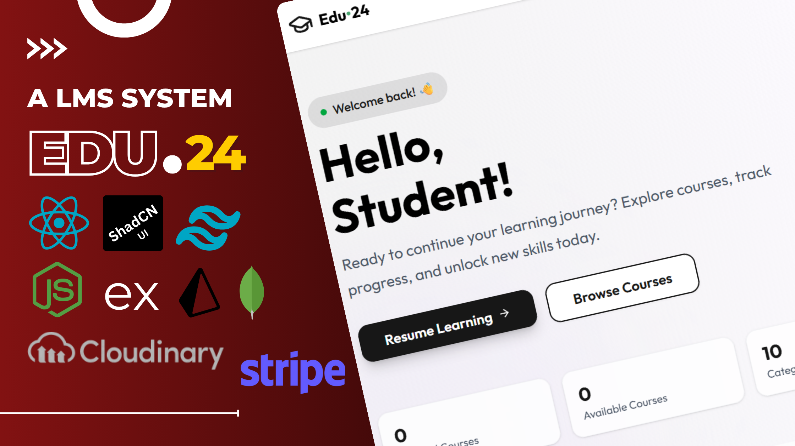
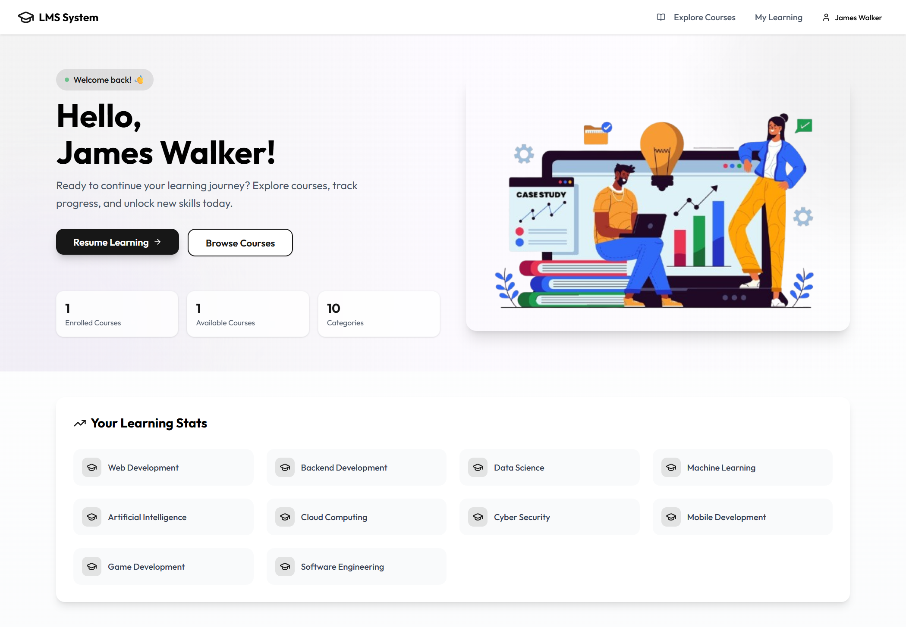
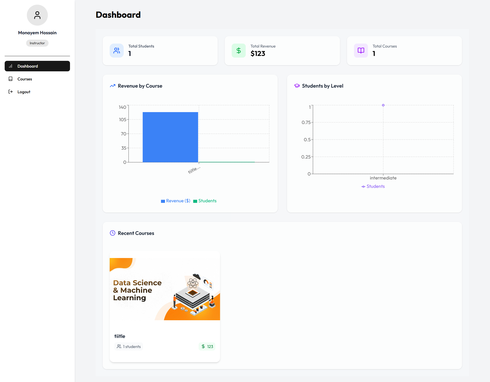
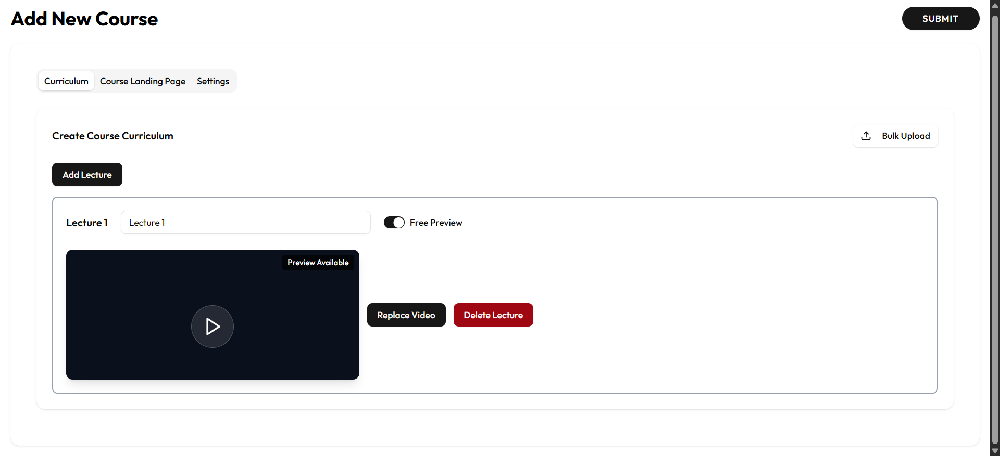

<div align="center">

    
             

</div>

# Learning Management System (LMS) - Edu'24



## Overview

This Learning Management System built with React and Node.js that allows instructors to create and manage courses while enabling students to enroll and learn effectively.

## Credentials

### Instructor Access
```properties
Email: instructor@edu24.com
Password: instructor123
```

> **Note:** Use these credentials to explore instructor features like:
> - Course creation and management
> - Curriculum building
> - Student progress tracking
> - Revenue monitoring
> - Analytics dashboard

### Student Access (Optional)
```properties
Email: student@edu24.com
Password: student123
```

> **Note:** Use these credentials to explore student features like:
> - Course browsing
> - Course enrollment
> - Course progress tracking
> - Free preview of selected lectures



## Tech Stack

- React 19 for frontend with Vite
- TailwindCSS for styling
- Shadcn UI components
- Axios for API calls
- React Router v6 for routing
- Context API for state management
- Cloudinary for media storage
- Stripe for payment processing
- JWT for authentication
- Node.js for backend
- Express for server
- MongoDB and Prisma for database

## Key Features

- Authentication
- User registration and login
- Role-based access control (Student/Instructor)
- JWT-based authentication
- Persistent auth state using localStorage

## Student Features

- Course browsing with filters and search
- Course enrollment with Stripe integration
- Course progress tracking
- Free preview of selected lectures
- Responsive video player
- Course completion tracking

## Instructor Features

- Course creation and management
- Rich course curriculum builder
- Video lecture upload system
- Student enrollment tracking
- Revenue monitoring
- Course analytics




## Major Implementation Challenges & Solutions

1. Files Upload System

- **Challenge:** Implementing progress tracking for large video uploads

- **Solution:**

  - How to Implement:

    1. Create a service to handle file uploads

    2. Track upload progress:

       - Calculate percentage based on loaded vs total bytes
       - Show progress bar to user
       - Update UI in real-time

    3. Handle success/failure states

  - **Tips:**
    1. Use FormData for file handling
    2. Implement progress tracking callback
    3. Show loading indicator for better user experience
    4. Handle network errors
    5. Validate file types and sizes

2. Course Media Management

- **Challenge:** Handling Cloudinary media deletion, especially course images

- **Current Issue:**

  - Videos delete successfully but course images remain in Cloudinary
  - Need to implement proper public_id tracking for course images

3. Payment Integration

- **Challenge:** Implementing secure payment flow with Stripe

- **Solution:**

  - Implementation Flow:
    1. Start payment process
    2. Redirect to Stripe checkout
    3. Handle payment success:
       - Verify payment status
       - Update enrollment status
       - Show success message
       - Redirect to courses page
    4. Handle payment failure:
       - Show error message
       - Allow retry
       - Maintain payment state

- **Key Points:**
  - Secure payment verification
  - Clear user feedback
  - Proper error handling
  - Smooth navigation flow

4. Course Progress Tracking

- **Challenge:** Real-time progress updates for students and streamlining course completion

- **Solution:**

  - How to Calculate:
    1. Get total number of lectures
    2. Track completed lectures
    3. Calculate percentage:
    4. Count completed lectures
    5. Divide by total lectures
    6. Multiply by 100
    7. Round to whole number

## Best Practices

1. Code Organization

   - Separate service layer
   - Context-based state management

2. Security

   - Protected routes
   - JWT token management
   - Secure payment handling

3. User Experience
   - Loading states
   - Error handling
   - Toast notifications
   - Responsive design

## Areas for Improvement

1. Media Management

   - Implement better tracking of Cloudinary assets
   - Improve image deletion functionality

2. State Management

   - Consider using `Redux/Zustand` for complex state
   - Implement better caching

3. Performance
   - Add `Suspense` for lazy loading for routes
   - Implement better video streaming
   - Add client-side caching

## Getting Started

**Installation:**

First, make sure you have `pnpm` or other package manager installed. You'll need to install dependencies for both client and server:

```
# Install dependencies in client directory
cd client
pnpm install

# Install dependencies in server directory 
cd ../server
pnpm install
```

**Environment Setup:**

```
Create a .env file in the both client and server directory and set the necessary environment variables for your application. Please refer to the .env.example file for more details.
```

**Development:**

Start the development

```
# Start the client (in client directory)
cd client
pnpm dev

# Start the server (in server directory)
cd server
pnpm dev
```

**Build:**

To build for production

```
# Build the client
cd client
pnpm build

# Build the server
cd server
pnpm build
```

## Author

**Monayem Hossain Limon**

- GitHub: [@Limon00001](https://github.com/Limon00001)
- LinkedIn: [monayem-hossain-limon](https://linkedin.com/in/monayem-hossain-limon)
- Date: May 25, 2025

---

Feel free to star ⭐ this repository if you find it helpful!
